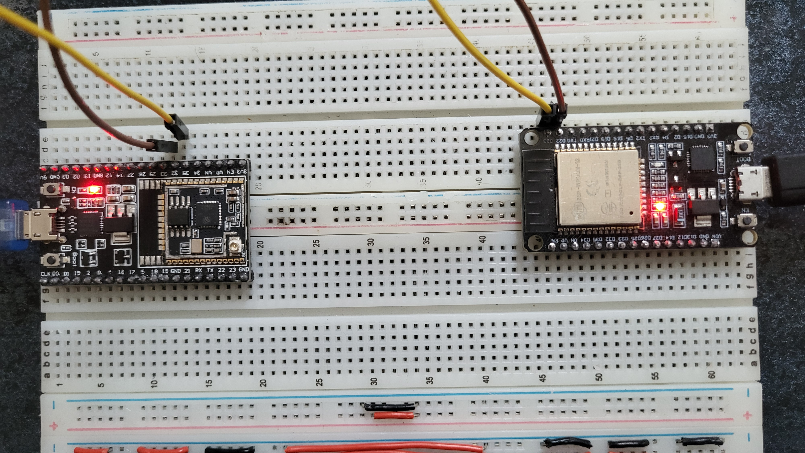

# ESP32 UART Communication Demo

## Overview
This project demonstrates **UART communication** between two **ESP32 DevKit v1** boards using **ESP-IDF** and FreeRTOS.  
Each device periodically sends a message containing its **MAC address**, UART instance number, TX pin, and current tick count.  
Received messages are printed to the console using `ESP_LOGI()`.

## Features
- Full-duplex UART communication between two ESP32 boards.
- Randomized transmission intervals (1–10 seconds).
- Device identification via MAC address.
- Separate FreeRTOS tasks for TX and RX.
- UART event handling:
  - `UART_DATA`, `UART_FIFO_OVF`, `UART_BUFFER_FULL`
  - line errors (`BREAK`, `PARITY_ERR`, `FRAME_ERR`)
- Internal pull-up on RX pin to avoid noise when the line is floating.

## Hardware Setup
- 2 × ESP32 DevKit v1
- Breadboard + jumper wires
- USB connection to PC

### Breadboard wiring

### Example console output

## Pinout used for this example
- Board 1:
  - UART2 instance
  - TX: GPIO33
  - RX: GPIO32

- Board 2:
  - UART1 instance
  - TX: GPIO23
  - RX: GPIO22

> You can modify UART instance and pins in `main.c` by changing `UART_PORT`, `TX_PIN`, and `RX_PIN`.

